# Tugas Praktikum { Pertemuan ke 9 } 


|**Nama**|**NIM**|**Kelas**|**Matkul**|
|----|---|-----|------|
|Muhammad Ikhsan Fakhrudin|312210019|TI.22.A.2|Basis Data|

# Soal Latihan Praktikum

- Implementasikan penggunaan ***CONSTRAINT FOREIGN KEY*** pada semua tabel yang berelasi.
- yang perlu diperhatikan:
  - tipe data pada field yang berelasi harus sama termasuk juga ukuran datanya.
  - misal: pada tabel dosen, kd_ds VARCHAR(10) maka tabel yang merujuk yaitu tabel mahasiswa, kd_ds juga harus bertipe VARCHAR(10).

1. Lakukan penambahan data pada tabel mahasiswa dengan mengisi kd_ds yang belum ada pada data dosen.
2. Hapus satu record data pada tabel dosen yang telah dirujuk pada tabel mahasiswa.
3. Ubah mode menjadi ***ON UPDATE CASCADE ON DELETE RESTRICT***
4. Lakukan perubahan data pada tabel dosen (kd_ds)
5. Lakukan penghapusan data pada tabel dosen
6. Ubah mode menjadi ***ON UPDATE CASCADE ON DELETE SET NULL***
7. Lakukan penghapusan data pada tabel dosen

## Evaluasi dan Pertanyaan

- ***Tulis semua perintah-perintah SQL percobaan di atas beserta outputnya!***
- ***Apa bedanya penggunaan RESTRICT dan penggunaan CASCADE***
- ***Berikan kesimpulan anda!***
- ***Buat laporan praktikum yang berisi, langkah-langkah praktikum beserta screenshot yang sudah dilakukan dalam bentuk dokumen.***

## Implementasi CONSTRAINT FOREIGN KEY

Berikut ini adalah langkah-langkah dan penerapan dalam pengimplementasian CONSTRAINT FOREIGN KEY pada Tabel mahasiswa dalam kolom kd_ds

- Pastikan kamu sudah mempunyai sebuah database yang berisi Tabel mahasiswa dan Tabel dosen, dan juga didalam tabel tersebut sudah berisi sebuah data. Berikut adalah contohnya:

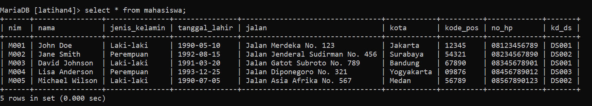

- Membuat foreign key

Dalam ALTER TABLE:

ALTER TABLE mahasiswa
```
ADD CONSTRAINT fk_dosenwali FOREIGN KEY (kd_ds)     REFERENCES dosen(kd_ds)
```

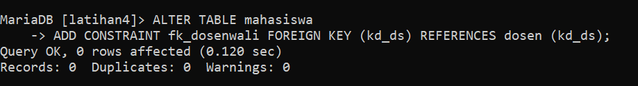

- Dalam CREATE TABLE:
```
CREATE TABLE mahasiswa(
nim VARCHAR(10) NOT NULL,
nama VARCHAR(100) NOT NULL,
kd_ds VARCHAR(10),
PRIMARY KEY(nim),
CONSTRAINT fk_DosenWali FOREIGN KEY (kd_ds)
REFERENCES dosen(kd_ds)
);
```

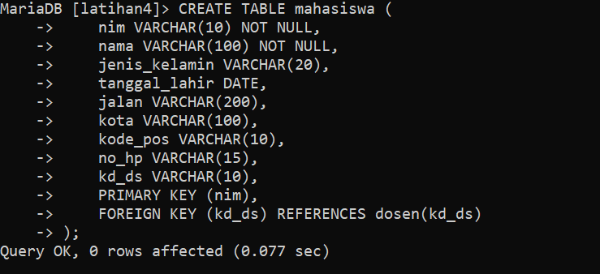

1. **Lakukan penambahan data pada tabel mahasiswa dengan mengisi kd_ds yang belum ada pada data dosen.
dengan menggunakan kode berikut :**
```
INSERT INTO dosen (kd_ds, nama) VALUES
('DS001', 'Abdillah'),
('DS002', 'Bima'),
('DS003', 'Catur'),
('DS004', 'Deni'),
('DS005', 'Endang');
```
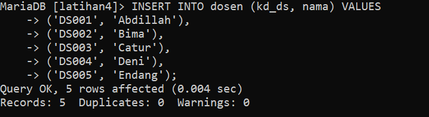

Outputnya :

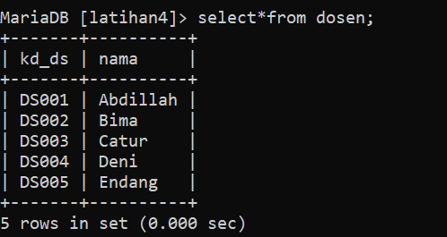

**2. Hapus satu record data pada tabel dosen yang telah dirujuk pada tabel mahasiswa.**  
```
DELETE FROM dosen WHERE kd_ds = 'DS001';
```
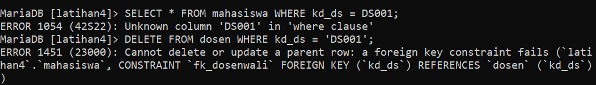

Jika ingin menghapus record dari tabel "dosen" yang memiliki referensi dari tabel "mahasiswa", Anda dapat menggunakan opsi ON DELETE CASCADE pada konstrain kunci asing untuk melakukan penghapusan secara otomatis dari tabel "mahasiswa" saat record dihapus dari tabel "dosen".

Berikut adalah perbaikan yang perlu dilakukan pada konstrain kunci asing fk_dosenwali di tabel "mahasiswa":
```
ALTER TABLE mahasiswa DROP  
    FOREIGN KEY fk_dosenwali;
```
```
ALTER TABLE mahasiswa
ADD CONSTRAINT fk_dosenwali
FOREIGN KEY (kd_ds)
REFERENCES dosen (kd_ds)
ON DELETE CASCADE;
```

Dengan perubahan di atas, ketika Anda menghapus record dari tabel "dosen" yang memiliki referensi di tabel "mahasiswa", record terkait dalam tabel "mahasiswa" juga akan secara otomatis dihapus.

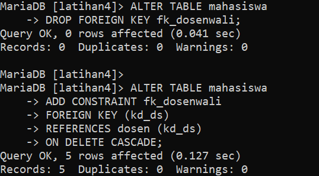

Setelah menjalankan perintah di atas, Anda dapat kembali mencoba menghapus record dengan menggunakan perintah berikut:
```
DELETE FROM dosen WHERE kd_ds = 'DS001';
```
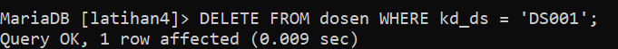

Output :

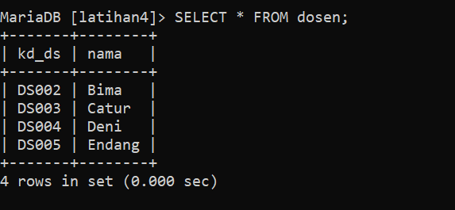

.png)

3. Ubah mode menjadi **ON UPDATE CASCADE ON DELETE RESTRICT** 

Untuk mengubah konstrain kunci asing menjadi **ON UPDATE CASCADE** dan ON **DELETE RESTRICT**, Anda perlu menghapus konstrain kunci asing yang ada dan menambahkan konstrain baru dengan opsi yang diinginkan. Berikut adalah langkah-langkahnya:

Hapus konstrain kunci asing yang ada pada tabel "mahasiswa":
```
ALTER TABLE mahasiswa
DROP FOREIGN KEY fk_dosenwali;
```
Tambahkan kembali konstrain kunci asing dengan opsi ON UPDATE CASCADE dan ON DELETE RESTRICT:
```
ALTER TABLE mahasiswa
ADD CONSTRAINT fk_dosenwali
FOREIGN KEY (kd_ds)
REFERENCES dosen (kd_ds)
ON UPDATE CASCADE
ON DELETE RESTRICT;
```
Output :

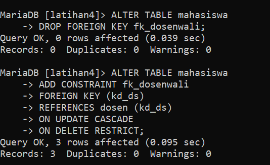

4. Lakukan perubahan data pada tabel dosen (kd_ds)

Berikut adalah contoh perintah untuk melakukan perubahan data pada tabel "dosen" dengan kolom "kd_ds":
```
UPDATE dosen
SET kd_ds = 'DS006'
WHERE kd_ds = 'DS001';
```
Perintah di atas akan mengubah nilai kolom `"kd_ds" dari "DS001" menjadi "DS006" pada tabel "dosen"`. Anda dapat menyesuaikan nilai yang ingin Anda ubah dan kondisi WHERE sesuai dengan kebutuhan Anda.

Pastikan untuk menjalankan perintah dengan hati-hati dan memastikan bahwa perubahan data yang Anda lakukan sesuai dengan kebutuhan dan kebijakan yang berlaku dalam basis data Anda.

***Output :***

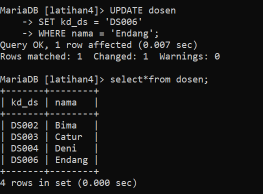

5. Lakukan penghapusan data pada tabel dosen

Untuk menghapus data dari tabel "dosen" dengan kondisi "kd_ds = 'DS003'", Anda dapat menggunakan perintah DELETE dengan sintaks yang benar. Berikut adalah contoh perintah yang dapat Anda gunakan:
```
DELETE FROM dosen
WHERE kd_ds = 'DS003';
```

***Output :***

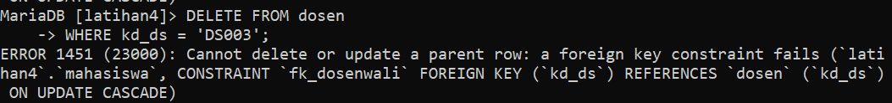

Output eror ? Jika ingin menghapus record dari tabel "dosen" yang memiliki referensi dari tabel "mahasiswa", Anda dapat menggunakan opsi ON DELETE SET NULL pada konstrain kunci asing untuk mengatur nilai yang mengacu pada record yang akan dihapus menjadi NULL. Berikut adalah perbaikan yang perlu dilakukan pada konstrain kunci asing fk_dosenwali di tabel "mahasiswa".

6. Ubah mode menjadi **ON UPDATE CASCADE ON DELETE SET NULL**
```
ALTER TABLE mahasiswa
DROP FOREIGN KEY fk_dosenwali;
```
```
ALTER TABLE mahasiswa
ADD CONSTRAINT fk_dosenwali
FOREIGN KEY (kd_ds)
REFERENCES dosen (kd_ds)
ON DELETE SET NULL;
```
***Output :***

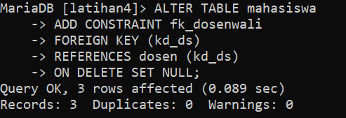

Dengan perubahan di atas, ketika Anda menghapus record dari tabel "dosen" yang memiliki referensi di tabel "mahasiswa", nilai kolom "kd_ds" dalam tabel "mahasiswa" yang mengacu pada record yang dihapus akan diatur menjadi NULL.

Setelah menjalankan perintah di atas, Anda dapat kembali mencoba menghapus record dengan menggunakan perintah berikut:

7. Lakukan penghapusan data pada tabel dosen
```
DELETE FROM dosen WHERE kd_ds = 'DS003';
```
***0utput :***

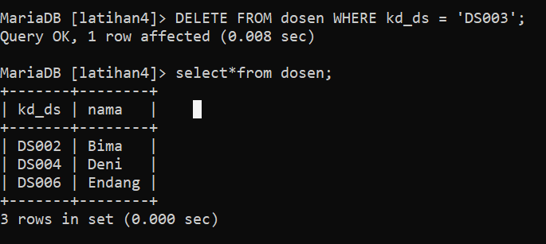

Perintah ini akan menghapus record dengan nilai "DS003" dari tabel "dosen", dan karena menggunakan opsi ON DELETE SET NULL, nilai kolom "kd_ds" dalam tabel "mahasiswa" yang mengacu pada record yang dihapus akan diatur menjadi NULL.

# Evaluasi dan Pertanyaan

### Tulis semua perintah-perintah SQL percobaan di atas beserta outputnya!

- Membuat foreign key

Dalam ALTER TABLE:
```
ALTER TABLE mahasiswa
ADD CONSTRAINT fk_dosenwali FOREIGN KEY (kd_ds)     REFERENCES dosen(kd_ds)
```

Dalam CREATE TABLE:
```
CREATE TABLE mahasiswa(
nim VARCHAR(10) NOT NULL,
nama VARCHAR(100) NOT NULL,
kd_ds VARCHAR(10),
PRIMARY KEY(nim),
CONSTRAINT fk_DosenWali FOREIGN KEY (kd_ds)
REFERENCES dosen(kd_ds)
);
```

- Mengubah data
```
UPDATE mahasiswa
SET kd_ds = 'DS011' WHERE nim = 112233445;
```

- Menampilkan CREATE TABLE
```
SHOW CREATE TABLE  mahasiswa;
Mode ON UPDATE CASCADE ON DELETE CASCADE
```
```
ALTER TABLE mahasiswa
DROP FOREIGN KEY fk_mahasiswa_dosen,
ADD CONSTRAINT fk_dosenwali FOREIGN KEY (kd_ds) REFERENCES dosen(kd_ds) ON UPDATE CASCADE ON DELETE CASCADE;
```

- Menghapus data
```
DELETE FROM dosen WHERE kd_ds = 'DS001';
Mode ON UPDATE CASCADE ON DELETE NOT NULL
```
```
ALTER TABLE <table>
DROP FOREIGN KEY <nama_constraint_lama>,
ADD CONSTRAINT <nama_constraint_baru> FOREIGN KEY (field) REFERENCES <table_references(filed_references)> ON UPDATE CASCADE ON DELETE NOT NULL;
```

- Mengubah data
```
UPDATE dosen
SET kd_ds = 'DS006' WHERE nama = 'Haha Hihi';
```

- Menghapus data
```
DELETE FROM dosen WHERE nim = 'DS003';
```

### Apa bedanya penggunaan RESTRICT dan penggunaan CASCADE

- **RESTRICT:** Ketika Anda menggunakan opsi RESTRICT, itu berarti bahwa tindakan penghapusan atau pembaruan yang Anda lakukan akan ditolak jika ada data yang memiliki hubungan referensial dengan data yang akan dihapus atau diperbarui. Dengan kata lain, RESTRICT menghentikan tindakan tersebut jika menyebabkan konflik referensial. Misalnya, jika Anda mencoba menghapus sebuah baris dalam tabel yang memiliki anak-anak yang terhubung melalui kunci asing, operasi penghapusan akan ditolak jika ada ketergantungan referensial yang berlaku. RESTRICT secara efektif membatasi tindakan Anda agar tidak merusak integritas referensial dalam basis data.

- **CASCADE:** Sebaliknya, ketika Anda menggunakan opsi CASCADE, itu berarti bahwa tindakan penghapusan atau pembaruan yang Anda lakukan akan mempengaruhi semua data yang memiliki hubungan referensial dengan data yang dihapus atau diperbarui. Dengan kata lain, CASCADE akan melakukan tindakan yang sama pada data yang terkait. Misalnya, jika Anda menghapus sebuah baris dalam tabel yang memiliki anak-anak yang terkait melalui kunci asing dengan opsi CASCADE, operasi penghapusan akan mempengaruhi tidak hanya baris yang dihapus tetapi juga semua baris anak yang terkait secara rekursif. Hal ini berguna ketika Anda ingin menghapus semua data terkait dengan entitas utama atau memperbarui nilai di semua tempat yang menggunakan entitas tersebut.

Dalam banyak kasus, pemilihan antara `RESTRICT dan CASCADE `tergantung pada kebutuhan bisnis dan hubungan data dalam basis data. Jika Anda ingin memastikan integritas referensial dan mencegah tindakan yang dapat merusak data, Anda dapat menggunakan RESTRICT. Namun, jika Anda ingin melakukan tindakan yang berdampak luas pada data yang terkait, Anda dapat menggunakan CASCADE.

### Berikan Kesimpulan anda !

- SQL Constraint digunakan untuk menentukan aturan untuk data dalam tabel.

  - Constraint digunakan untuk membatasi jenis data yang bisa masuk ke tabel. Ini memastikan keakuratan dan keandalan data dalam tabel.

  - Constraint dapat berupa level kolom atau level tabel.

  - Constraint level kolom berlaku untuk kolom, dan batasan level tabel berlaku untuk seluruh tabel.

- **RESTRICT** membatasi tindakan penghapusan atau pembaruan jika ada ketergantungan referensial yang akan terganggu. Ini menjaga integritas referensial dalam basis data.

- **CASCADE** melakukan tindakan yang sama pada data yang terkait. Jika Anda menghapus atau memperbarui data, CASCADE akan mempengaruhi semua data terkait, termasuk data anak yang terhubung secara rekursif.  

***Buat laporan praktikum yang berisi, langkah-langkah praktikum beserta screenshot yang sudah dilakukan dalam bentuk dokumen.***


## FINISH